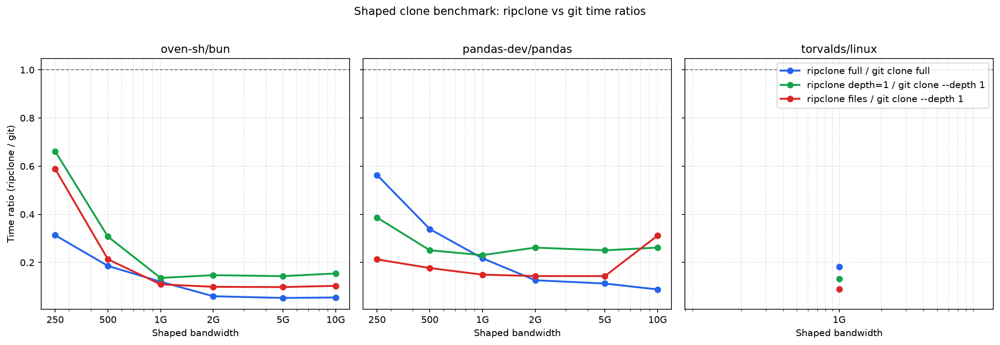

<p align="center">
  
</p>

# ripclone

ripclone is the fastest way to clone git repos. Large repos see 5x-10x speedup; small repos are also a bit faster.

ripclone pre-builds git artifacts for every pushed commit so that agents, CI systems, and humans can clone a repo and start working in seconds instead of waiting for a full `git clone`. It is **read-only** and **clone-only**: it does not proxy commits or pushes. You use normal git with your own credentials for writes.

It works as two operations: you **sync** a repo so the server pre-builds its artifacts (automatic on every push), then you **clone** it — the client downloads those artifacts and writes the working tree in seconds.

It is self-hostable and host-agnostic — point it at GitHub, GitLab, Gitea, Bitbucket, or any git host — and works for private or public repos. For the easiest experience, sign up for free (for public repos) at [Ripclone Cloud](https://ripclone.com).

ripclone started from a simple question asked by [Jarred Sumner](https://x.com/jarredsumner/status/2066420871753838913): 

> *"It's hard to imagine why cloning a git repo should be much slower than downloading an equivalent-sized file. Where are the experiments with custom git clients that clone faster?"* 

ripclone is one answer. The goal: get a `git clone` as close as possible to downloading a file from object storage. A few design principles get there:

| Principle | In practice |
|---|---|
| **Move slow work off the clone** | Negotiation, indexing, and the tree walk run once on the server at sync — never on the clone. The client just downloads finished pieces and writes them. |
| **Parallelize the downloads** | Packs and the archive are content-addressed chunks, so a clone is many parallel range-GETs, not one serial stream. |
| **Keep every resource busy** | Every stage runs across all cores *and* overlaps in time — the next starts the moment the last produces output. Network, CPU, and disk never idle (io_uring on Linux). |
| **Process as little as possible** | A re-sync rebuilds only what the diff touched; a clone fetches only the artifacts its mode needs — files mode skips the object database entirely. |

## Clone

On every push, ripclone prebuilds a **clonepack** for `HEAD` — a set of files in object storage laid out so a clone has almost nothing left to do but download and write. Pick how much you pull with `--mode`:

`--mode=editable` (the default) installs a git pack of `HEAD`'s objects — a real repo, the same as `git clone --depth=1`, where `git diff`/`show`/`log` and commits all work. `--depth N` or `--depth 0` pull more history.

`--mode=files` writes the working tree straight from a zstd archive — the fastest path when you only need the files (agents, CI). No git object database, so `git diff`/`show` don't work.

See **[Design](docs/DESIGN.md)** for how a clonepack is built and synced.

### Performance

ripclone pre-builds git artifacts so clones are faster than `git clone` across the bandwidths we tested, from 250 Mbps up to 10 Gbps. On a 1 Gbps link the wins are largest; as bandwidth drops the download itself dominates and the gap narrows.

At 1 Gbps, measured speedups over native `git clone` are:

- **`oven-sh/bun`**: full clone **8.3×**, depth-1 **7.4×**, files **9.2×**.
- **`pandas-dev/pandas`**: full clone **4.6×**, depth-1 **4.3×**, files **6.7×**.
- **`torvalds/linux`** (1 Gbps only, prior run): full clone **5.5×**, depth-1 **7.6×**, files **11.2×**.

The full-clone win is smaller on pandas than on bun because pandas's full pack is large enough that transfer dominates; depth-1 and `files` mode avoid most of that transfer, so they stay ahead. The shaped sweep now covers **250/500 Mbps and 1/2/5/10 Gbps** to match modern links; the old 50 Mbps row and warm-cache baselines have been dropped because they are not representative for real clones.

*Mode labels:* `ripclone full` and `ripclone depth=1` are the `editable` CLI mode with `--depth 0` and `--depth 1`, respectively. `ripclone files` is the `files` CLI mode (HEAD worktree only).

#### Shaped bandwidth benchmark

We run `ripclone` against native `git clone` on a Fly.io `performance-8x` client talking to `ripclone-server-dev` over shaped links. Each cell is the median of 3 runs with a cold client cache (`RIPCLONE_NO_CACHE=1`). `oven-sh/bun` is pinned to commit `b2aa0d5d94e3a42d88d4c58e4488c07e67b0f037`; `pandas-dev/pandas` is pinned to tag `v2.2.2` (`d9cdd2ee5a58015ef6f4d15c7226110c9aab8140`).

The sweep covers **250/500 Mbps and 1/2/5/10 Gbps** to match modern links. The old 50 Mbps row and warm-cache baselines have been dropped because they are not representative for real clones.

**`oven-sh/bun`**

| Mbps | ripclone full | ripclone depth=1 | ripclone files | git clone full | git clone --depth 1 |
|------|---------------|------------------|----------------|----------------|---------------------|
| 10000 | 2.1 s | 1.0 s | 0.7 s | 38.9 s | 6.8 s |
| 5000 | 2.0 s | 1.0 s | 0.7 s | 38.8 s | 6.7 s |
| 2000 | 2.3 s | 1.0 s | 0.7 s | 38.3 s | 6.7 s |
| 1000 | 4.8 s | 0.9 s | 0.7 s | 39.7 s | 6.6 s |
| 500 | 7.1 s | 1.0 s | 0.7 s | 38.3 s | 3.4 s |
| 250 | 13.3 s | 2.2 s | 2.0 s | 42.5 s | 3.4 s |

**`pandas-dev/pandas`**

| Mbps | ripclone full | ripclone depth=1 | ripclone files | git clone full | git clone --depth 1 |
|------|---------------|------------------|----------------|----------------|---------------------|
| 10000 | 2.0 s | 0.5 s | 0.6 s | 22.4 s | 1.9 s |
| 5000 | 2.4 s | 0.5 s | 0.3 s | 21.4 s | 1.9 s |
| 2000 | 2.8 s | 0.5 s | 0.3 s | 21.9 s | 1.8 s |
| 1000 | 4.7 s | 0.4 s | 0.3 s | 21.8 s | 1.8 s |
| 500 | 7.3 s | 0.5 s | 0.3 s | 21.7 s | 1.9 s |
| 250 | 14.7 s | 0.7 s | 0.4 s | 26.1 s | 1.9 s |

**`torvalds/linux`** (1 Gbps only, prior run)

| Mbps | ripclone full | ripclone depth=1 | ripclone files | git clone full | git clone --depth 1 |
|------|---------------|------------------|----------------|----------------|---------------------|
| 1000 | 84.3 s | 4.4 s | 3.0 s | 462.9 s | 33.5 s |

The ratio graph shows **ripclone time / git time**; anything below the dashed `1.0` line means ripclone was faster.



## Install

Pick whichever fits. All install the `ripclone` CLI (and `ripclone-server`, `ripclone-worker`, `git-remote-ripclone`).

```sh
# 1. Shell installer (prebuilt binaries)
curl -fsSL https://github.com/russellromney/ripclone/releases/latest/download/install.sh | sh

# 2. Cargo (builds from source; also `cargo add ripclone` to embed the client lib)
cargo install ripclone --locked

# 3. pip (prebuilt wheel)
pip install ripclone
```

The prebuilt binaries link their C libraries (libgit2, openssl, zstd) dynamically; on Linux install the runtime packages (`libgit2`, `libssl3`), on macOS `brew install libgit2 openssl@3`. `cargo install` builds them from source instead.

Check your version and whether the configured server is compatible:

```sh
ripclone --version
ripclone version            # CLI + server versions, with a compatibility verdict
ripclone update             # check for a newer release
```

## Quick start

Build and run the server:

```bash
cd rust
cargo build --release

# Start the server locally
./target/release/ripclone-server \
  --cas-dir ./data/cache \
  --repo-root ./data/repos
```

`--cas-dir` is the local cache; `--repo-root` holds the mirrors. `--host` (default `0.0.0.0`) and `--port` (default `8000`) set the listen address. Object storage (S3/R2/Tigris/MinIO) and most tuning are set with environment variables — see [Build options](#build-options) and `docs/BACKENDS.md`.

Build artifacts for a commit (sync the repo on the server):

```bash
cargo run --release --bin ripclone -- sync oven-sh/bun --server http://localhost:8000
```

Clone it:

```bash
cargo run --release --bin ripclone -- clone oven-sh/bun --dir bun --server http://localhost:8000
```

Add a fast worktree (Linux, reuses local objects and overlay staging):

```bash
cd bun
cargo run --release --bin ripclone -- worktree ../bun-wt -b HEAD
```

## GitHub Actions trigger

Add a workflow to a repo so ripclone builds artifacts on every push. Set `RIPCLONE_URL` as a repository variable and `RIPCLONE_SERVER_TOKEN` as a repository secret. (A ready-to-copy version lives in [`docs/examples/github-actions-trigger.yml`](docs/examples/github-actions-trigger.yml).)

```yaml
name: ripclone cache
on: push
jobs:
  notify:
    runs-on: ubuntu-latest
    steps:
      - name: Trigger ripclone sync
        run: |
          curl -fsSL -X POST \
            -H "Authorization: Ripclone ${{ secrets.RIPCLONE_SERVER_TOKEN }}" \
            "${{ vars.RIPCLONE_URL }}/v1/repos/github/${{ github.repository_owner }}/${{ github.event.repository.name }}/sync"
```

The `github` in the path is the provider instance (see [Providers](#providers)). For private repos the server needs read access to the upstream — configure a token for the provider, or pass one per request in the `X-Upstream-Token` header.

ripclone validates the `RIPCLONE_SERVER_TOKEN`, syncs the mirror, builds artifacts for the new `HEAD`, and returns the artifact hashes.

### Native push webhook (no per-repo workflow)

Instead of (or alongside) the Actions workflow, point a provider webhook at the server so it builds on every push with nothing added to the consumer repo. Set a per-provider secret, then add a repository/org webhook:

- **Payload URL:** `https://ripclone.example.com/webhooks/github` (`/v1/webhooks/github` is a back-compat alias)
- **Content type:** `application/json`
- **Secret:** the value of `RIPCLONE_WEBHOOK_SECRET_GITHUB` (the legacy `RIPCLONE_WEBHOOK_SECRET` is still honored for github)
- **Events:** the `push` event.

The server verifies the provider HMAC (`X-Hub-Signature-256`) over the raw body — constant-time, before any parse — then triggers a build via the same queue `/sync` uses, so artifacts are ready before any clone. Fail-closed: a provider with no configured secret returns `503`; a bad signature `401`. Branch deletes clean up that ref; tags/ping are acknowledged with no build.

By default the **default branch** is always warmed and other branches only if already built (so throwaway branches don't warm). Set `RIPCLONE_WEBHOOK_WARM_ALL=1` to warm every pushed branch, or `RIPCLONE_WEBHOOK_ALLOWLIST` to restrict which repos warm (comma-separated; GitHub repos are `owner/repo`, other providers are prefixed: `gitlab/group/sub/proj`). The receiver is provider-agnostic — **GitHub, GitLab, and Gitea/Forgejo** are supported (point the provider at `/webhooks/{provider}`, e.g. `/webhooks/gitlab`). Two per-provider notes: GitLab must use the **secret-token** webhook setting (the value of `X-Gitlab-Token`), not the newer signing-token scheme; and a Gitea/Forgejo webhook must have the **Delete** event enabled for branch-delete cleanup to fire. See [`docs/WEBHOOKS.md`](docs/WEBHOOKS.md).

### Polling fallback

For repos without a webhook, or to catch a missed delivery, set `RIPCLONE_POLL_INTERVAL_SECS` (default `0` = off). The server periodically `ls-remote`s known repos and builds any whose tip moved. This is a backstop; webhooks/Actions are the prompt path.

## CLI usage

By default the CLI talks to the managed [Ripclone Cloud](https://ripclone.com). Point it at a self-hosted server with `--server`, the `RIPCLONE_SERVER` env var, or `ripclone login`. (Resolution order: `--server` > `RIPCLONE_SERVER` > saved login config > cloud.)

```bash
# Authorize this machine against the cloud (saves a token), or sign out
ripclone login
ripclone logout

# Show CLI + server versions and compatibility, and check for a newer release
ripclone version
ripclone update

# Clone a repo (public or private) — github is the default provider
ripclone clone owner/repo
ripclone clone owner/repo --branch feat/x --dir ./my-dir

# Another host: prefix the repo, or pass --provider (see Providers below)
ripclone clone gitlab:mygroup/project
ripclone --provider my-gitea clone owner/repo

# Working tree only (no git object database), fastest for files-only jobs
ripclone clone owner/repo --mode files

# History depth: 1 = HEAD only (default), N = last N commits, 0 = full history
ripclone clone owner/repo --depth 0

# Clone the artifacts built for a specific rev (pairs with `sync --at`)
ripclone clone owner/repo --at HEAD~5

# Ephemeral, in-memory (tmpfs) clone for throwaway agent/CI machines (Linux)
ripclone clone owner/repo --temp

# Print a per-phase benchmark report after the clone
ripclone clone owner/repo --bench

# Build/refresh artifacts on the server
ripclone sync owner/repo
ripclone sync owner/repo --depth 1             # shallow mirror
ripclone sync owner/repo --at HEAD~5           # build at a past rev

# Add a fast worktree inside an existing clone
ripclone worktree ../wt -b HEAD
```

For a private repo, pass an upstream credential with `--token`. The client sends it as `X-Upstream-Token` and the server translates it to the host's auth form (GitHub, GitLab, Gitea, …):

```bash
ripclone --token ghp_xxx clone my-org/private-repo
```

Pushes go to your git host directly, not through ripclone.

## Providers

By default ripclone knows one host: the built-in `github` instance. To mirror from GitLab, Gitea/Forgejo/Codeberg, Bitbucket, or a self-hosted host, register provider instances on the server with the `RIPCLONE_PROVIDERS` environment variable (or a JSON config file):

```bash
export RIPCLONE_PROVIDERS='[
  {"id":"gitlab","kind":"gitlab","host":"gitlab.com"},
  {"id":"company-gitea","kind":"gitea","host":"git.example.com","token":"gitea-token"}
]'
```

Supported `kind` values: `github`, `gitlab`, `bitbucket`, `gitea`, `generic`. A `generic` host needs an `auth_template` (e.g. `"token {token}"`) so ripclone knows how to build the auth header. Then address a repo by instance id — `gitlab:mygroup/project` on the CLI, or `/v1/repos/gitlab/mygroup/project/...` on the API.

## Architecture

```
┌──────────────────┐
│  push / CI hook  │  POST /sync
└────────┬─────────┘
         ▼
┌──────────────────┐   enqueue   ┌──────────────────┐
│ ripclone-server  │ ──────────▶ │    sync queue    │
│ resolve · serve  │             │ in-process / SQL │
└────────┬─────────┘             └────────┬─────────┘
         │ serves                  claim  │
         ▼                                ▼
      clients               ┌──────────────────┐
                            │ ripclone-worker  │ ×N
                            │  fetch · build   │
                            └────────┬─────────┘
                                     ▼ writes
                       ┌────────────────────────────┐
                       │  artifact store · metadata │
                       │  object/local · SQLx/file  │
                       └────────────────────────────┘
```

ripclone splits into a **server** — it resolves refs, serves artifacts, and enqueues a sync job on every push — and one or more **workers** (`ripclone-worker`) that claim jobs from the queue, `git fetch` the upstream, and build the clonepack. On a single box the worker runs inside the server; with a SQL queue you run a farm of workers across machines. Three backends are pluggable, each set with environment variables (see [`docs/BACKENDS.md`](docs/BACKENDS.md)):

- **Artifact store.** Where clonepacks live: object storage (S3 / R2 / Tigris / MinIO), with signed URLs so clients read straight from it, or local disk. Local disk also caches hot artifacts in front of object storage. A background GC drops artifacts nothing references (after a grace period, so an in-flight upload is never deleted).
- **Metadata store.** The ref → clonepack mapping and build status. Any database SQLx supports (Postgres, MySQL, SQLite, libsql/Turso), or a file / object-storage store. Writes are ordered so a newer sync never loses to an older one.
- **Sync queue.** Pending build jobs: in-process for a single box, or SQL-backed so workers can claim jobs across machines. Upstream credentials are resolved per worker and never stored in the queue.

**Your git host stays the source of truth** for repos, refs, permissions, and writes. Clients download artifacts (signed URL or server proxy), decompress, and write files straight to disk. Public endpoints are rate-limited.

Ops endpoints: `GET /healthz` (alive?), `GET /readyz` (ready? — `503` if storage or the ref store is down), and `GET /metrics` (Prometheus format). There's also a plain-git fallback (`/v1/git/{owner}/{repo}/...`) so a normal `git clone` still works if the fast path is down.

## Build options

By default the Rust crate uses `zlib-ng` for faster pack compression. On platforms without cmake you can build with the stock zlib instead:

```bash
cd rust
cargo build --release --no-default-features
```

Environment variables for tuning clone performance:

- `RIPCLONE_FETCH_CONCURRENCY` — max concurrent chunk downloads (default 6).
- `RIPCLONE_FETCH_THREADS` / `RIPCLONE_WRITE_THREADS` — thread counts for archive extraction.
- `RIPCLONE_FETCH_MAX_ATTEMPTS` / `RIPCLONE_FETCH_BACKOFF_MS` — retry budget and base backoff for transient download failures (defaults 3 and 100).
- `RIPCLONE_IO_URING` — the worktree writer uses io_uring by default on Linux; set `=0` to force the POSIX writer. `RIPCLONE_IO_URING_DEPTH` (default 2) tunes per-thread ring overlap.
- `RIPCLONE_MODE` — default clone mode (`editable` or `files`) when `--mode` is omitted.
- `RIPCLONE_CACHE_DIR` / `RIPCLONE_NO_CACHE` — opt in to (or force off) a local artifact cache; off by default.

Server-side backends are configured through environment variables: storage and retention (`RIPCLONE_S3_*`, `RIPCLONE_RETENTION_*`, `RIPCLONE_REMOTE_GC_*`), the metadata store (`RIPCLONE_METADATA*`), and the build queue / farm-out workers (`RIPCLONE_QUEUE*`). See `docs/BACKENDS.md` and `docs/CHANGELOG.md` for the full list.

## License

Licensed under either of

- Apache License, Version 2.0 ([LICENSE-APACHE](LICENSE-APACHE) or <http://www.apache.org/licenses/LICENSE-2.0>)
- MIT license ([LICENSE-MIT](LICENSE-MIT) or <http://opensource.org/licenses/MIT>)

at your option.

Unless you explicitly state otherwise, any contribution intentionally submitted
for inclusion in the work by you, as defined in the Apache-2.0 license, shall be
dual licensed as above, without any additional terms or conditions.
