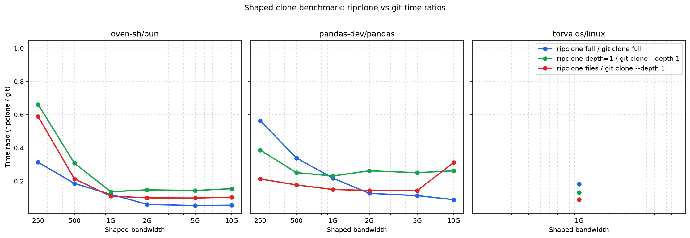

# Benchmarks

This is the authoritative benchmark reference. The [README](../README.md#performance) carries a single summary table and links here for the full sweep.

Reproduce with [`benchmark/run_shaped_sweep.sh`](../benchmark/run_shaped_sweep.sh) on a client machine pointed at a ripclone server.

For representative comparisons, use a real SSD/NVMe filesystem. Memory-backed
temporary directories can hide filesystem, fsync, and worktree materialization
bottlenecks.

## How to read these numbers

ripclone pre-builds git artifacts so clones are faster than `git clone` across
the 250 Mbps to 1 Gbps shaped links we tested. We also have a high-bandwidth
Linux run for `torvalds/linux` at 1/2/5 Gbps. On fast links the wins are largest;
as bandwidth drops the download itself dominates and the gap narrows.

Every speedup below compares like with like: a full clone against `git clone`, and depth-1 and `files` against `git clone --depth 1` (the closest git equivalent — both fetch only the tip). Comparing `files` against a full `git clone` would inflate the number several-fold, so we don't.

At 1 Gbps, measured speedups are:

- **`oven-sh/bun`**: full clone **11.7×**, depth-1 **3.3×**, files **5.4×**.
- **`pandas-dev/pandas`**: full clone **7.6×**, depth-1 **6.0×**, files **7.4×**.
- **`torvalds/linux`** (high-bandwidth EC2 run): full clone up to **~10×**, depth-1 **~6×**, files **~8×**.

The full-clone win is smaller on pandas than on bun because pandas's full pack is large enough that transfer dominates; depth-1 and `files` mode avoid most of that transfer, so they stay ahead.

*Mode labels:* `ripclone full` and `ripclone depth=1` are the `editable` CLI mode with `--depth 0` and `--depth 1`, respectively. `ripclone files` is the `files` CLI mode (HEAD worktree only).

## Shaped bandwidth sweep

We ran `ripclone` against native `git clone` on separate 8-vCPU cloud client
and server VMs, with the client↔server link shaped to the listed bandwidth.
Each cell is the median of 3 runs with a cold client cache
(`RIPCLONE_NO_CACHE=1`). `oven-sh/bun` is pinned to commit
`b2aa0d5d94e3a42d88d4c58e4488c07e67b0f037`; `pandas-dev/pandas` is pinned to
tag `v2.2.2` (`d9cdd2ee5a58015ef6f4d15c7226110c9aab8140`).

The sweep covers **250/500 Mbps and 1 Gbps**. The old 50 Mbps and 100 Mbps rows
and warm-cache baselines have been dropped because they are not representative
for real clones. For higher-bandwidth numbers, see the Linux rows below.

**`oven-sh/bun`**

| Mbps | ripclone full | ripclone depth=1 | ripclone files | git clone full | git clone --depth 1 |
|------|---------------|------------------|----------------|----------------|---------------------|
| 1000 | 3.443 s | 1.023 s | 0.625 s | 40.26 s | 3.37 s |
| 500 | 6.136 s | 0.785 s | 0.588 s | 39.72 s | 3.60 s |
| 250 | 12.580 s | 2.006 s | 1.542 s | 41.07 s | 3.33 s |

**`pandas-dev/pandas`**

| Mbps | ripclone full | ripclone depth=1 | ripclone files | git clone full | git clone --depth 1 |
|------|---------------|------------------|----------------|----------------|---------------------|
| 1000 | 2.996 s | 0.316 s | 0.256 s | 22.75 s | 1.90 s |
| 500 | 5.719 s | 0.346 s | 0.250 s | 22.81 s | 1.90 s |
| 250 | 11.966 s | 0.315 s | 0.232 s | 26.20 s | 1.87 s |

Key takeaways:

- **ripclone wins at every measured bandwidth** for full-history and files-mode clones, with the biggest margins at 1 Gbps (up to **11.7×** for `oven-sh/bun` full clone).
- **The gap narrows as bandwidth drops.** At 250 Mbps the full-clone win is still **3.3×** for bun and **2.2×** for pandas, while depth-1 remains faster than `git clone --depth 1`.
- **Above 1 Gbps, use a real high-bandwidth client.** The Linux run below is the
  current high-bandwidth proof at 1/2/5 Gbps.

The ratio graph shows **ripclone time / git time**; anything below the dashed `1.0` line means ripclone was faster.



## High-bandwidth Linux on EC2

`torvalds/linux` was measured from a 32-vCPU high-bandwidth Linux client talking
to the same test server. The client↔server link was shaped with `nftables`;
ripclone modes got 3 runs and Git baselines got 1 run.

Pinned to `torvalds/linux` @ `ab9de95c9cf952332ab79453b4b5d1bfca8e514f`:

| Mbps | ripclone full | ripclone depth-1 | ripclone files | git clone full | git clone --depth 1 |
|------|---------------|------------------|----------------|----------------|---------------------|
| 1000 | 83.2 s | 3.57 s | 2.33 s | 280.2 s | 18.2 s |
| 2000 | 44.3 s | 2.97 s | 2.42 s | 279.1 s | 18.3 s |
| 5000 | 28.4 s | 3.04 s | 2.75 s | 280.5 s | 18.2 s |

That's **~10× faster than `git clone`** for the full history at 5 Gbps, and **~6× faster** for depth-1. The unshaped/raw-pipe ceiling was similar for full (30.0 s) but noticeably lower for the small fast paths — depth-1 hit 2.84 s and files hit 2.23 s — confirming that `nftables` shaping adds a little overhead once the transfer itself is no longer the bottleneck.

## Files-only archive benchmark

GitHub's source archive endpoint (`codeload.github.com/.../tar.gz/...`) is the
closest built-in comparison for `ripclone --mode=files`: both produce a
worktree without Git history. Both wrote extracted files to the same NVMe
volume.

| Repo | ripclone files | GitHub tar.gz | Result |
|------|----------------|---------------|--------|
| `oven-sh/bun` | 0.640 s | 1.800 s | ripclone **2.8× faster** |
| `pandas-dev/pandas` | 0.328 s | 0.210 s | GitHub tar.gz faster on this small, warm archive |
| `torvalds/linux` | 4.053 s | 37.427 s | ripclone **9.2× faster** |

The Linux run is the important stress case for files mode: 94,655 files and a 1.8 GB materialized worktree. `ripclone files` resolved to `ab9de95c9cf952332ab79453b4b5d1bfca8e514f` and used the existing archive artifacts in object storage; no re-sync was required.

## Running the sweep yourself

```bash
# Full sweep, 3 runs per cell.
RIPCLONE_URL=https://your-ripclone-server.example.com \
RIPCLONE_SERVER_TOKEN=... \
./benchmark/run_shaped_sweep.sh "oven-sh/bun pandas-dev/pandas" "250 500 1000" 3

# Faster 3-rate sweep for pandas, pinned to the v2.2.2 commit.
# GIT_REF tells the native-git baseline which tag to clone.
BENCH_REF=d9cdd2ee5a58015ef6f4d15c7226110c9aab8140 GIT_REF=v2.2.2 \
RIPCLONE_URL=https://your-ripclone-server.example.com \
RIPCLONE_SERVER_TOKEN=... \
./benchmark/run_shaped_sweep.sh "pandas-dev/pandas" "250 500 1000" 1
```

For fast-moving branches, pass a commit SHA (or a tag plus `GIT_REF`) to `BENCH_REF`. If you pass a branch name, the harness resolves it once and pins that commit for the rest of the sweep so `HEAD` movement can't invalidate later rates.

## Why ripclone is faster

`git clone` makes the upstream host compute and stream a pack on demand (delta negotiation + server-side compression), then the client runs `index-pack`. ripclone serves pre-built, content-addressed packs from object storage, downloaded in parallel; the worktree is materialized from pre-built packs and history is installed without negotiation or on-the-fly delta compression. The expensive work happens once at sync time, not per clone.

## Honest caveats

- **Sync pays the cost.** The fast clone is amortized against a full build per sync (bun: ~1m40 first full build; incremental re-syncs are cheaper). First sync of a big repo is still the price.
- **Edge cache.** These runs had objects warm in the in-region object-storage edge. A first clone from a cold region pays an edge-cache miss. This is inherent to using object storage as the CDN.
- **Same-datacenter network.** The test client and object storage had a fast
  path. A laptop on home Wi-Fi is bounded by its own download speed, but still
  skips Git's server-side pack computation.
